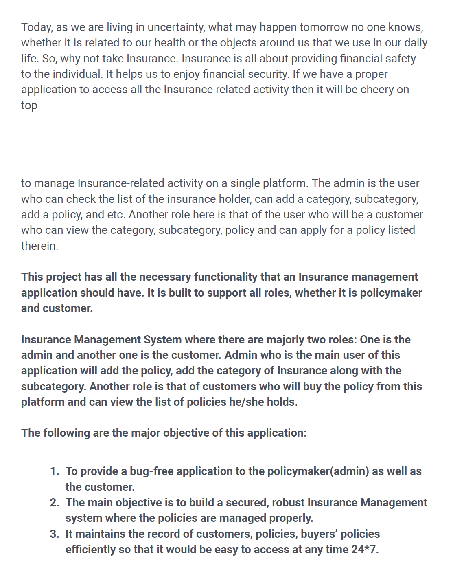
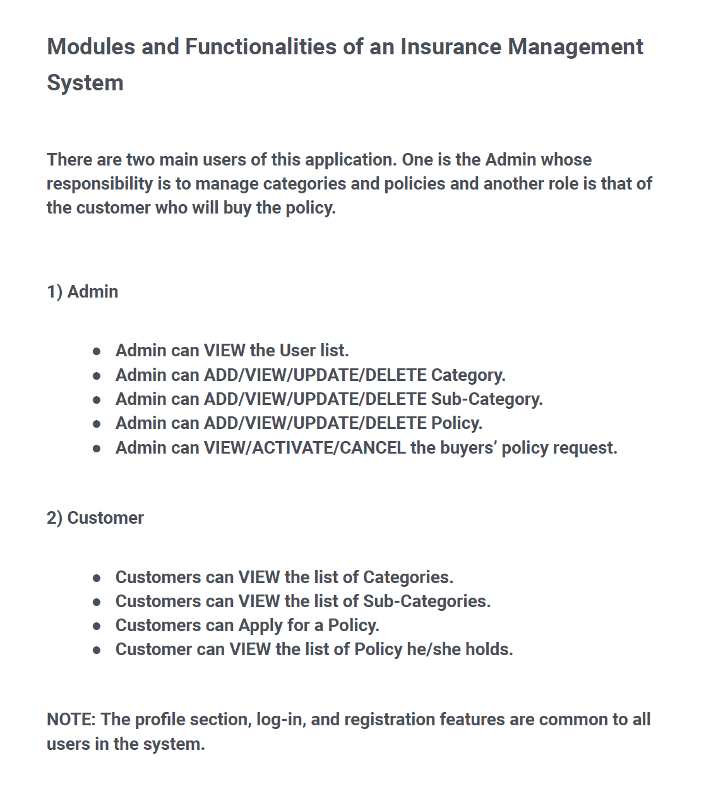

# Insurance-Management-System-Core-Java
## Java Bootcamp Project 1(2023)

# Project Instructions



## Prerequisites

Before you begin, ensure you have met the following requirements:
- Java Development Kit (JDK 17)
- Eclipse IDE or any other Java IDE
- 
## Installation

1. Clone the repository:

    ```bash
    git clone https://github.com/tusharmahat/Insurance-Management-System-Core-Java-.git
    ```

2. Run the project:
    open the project in Eclipse IDE and run ImsMainClient.java(contains main method of the program)

